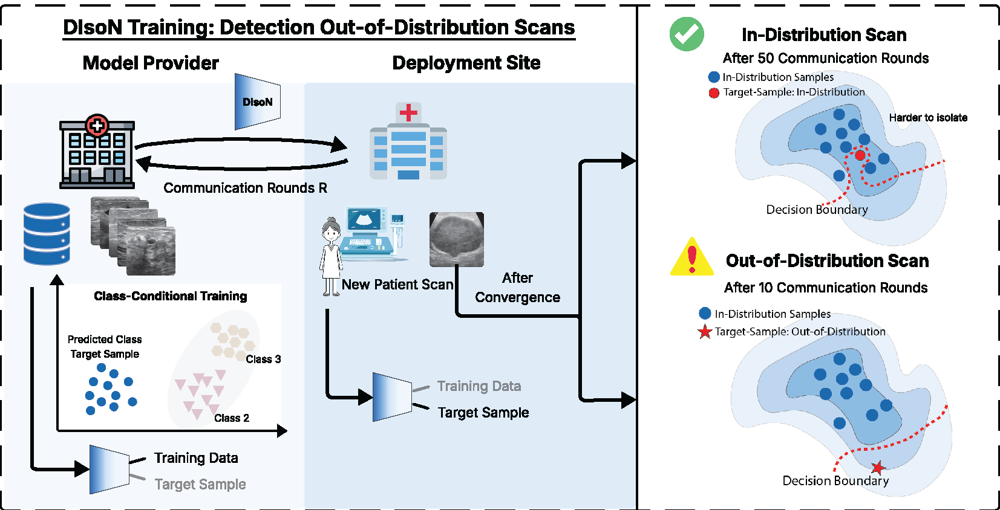

# [NeurIPS 2025] 🧹💨 DIsoN: Decentralized Isolation Networks for Out-of-Distribution Detection in Medical Imaging

<h5 align="center">

[](https://arxiv.org/pdf/2506.09024?)
[](https://github.com/FelixWag/DIsoN/blob/main/LICENSE)
 <br>

</h5>

---

🔥 **NEWS**: DIsoN got accepted at NeurIPS 2025 🔥

This repository contains the official implementation of our paper, Wagner et al., [DIsoN: Decentralized Isolation Networks for
Out-of-Distribution Detection in Medical Imaging](https://arxiv.org/pdf/2506.09024?), accepted at NeurIPS 2025. If you find this code useful for your research, please cite our paper. You can find the BibTeX citation and dataset references at the end of the README in the **[Citation](#citation)** and **[References](#references)** sections.



## Introduction

---
Most OOD detection methods assume that the training data can be stored together with the deployed model, but in medical applications, privacy and legal constraints usually prevent this. As a result, deployed models struggle to reliably detect inputs that differ from the training distribution, such as unseen pathologies, acquisition shifts, or imaging artifacts.

We propose **Decentralized Isolation Networks (DIsoN)**, an OOD detection framework that enables direct comparison between new test samples and the original training data without sharing any data. **The main idea**: measure how difficult it is to separate a new sample from the training distribution. DIsoN achieves this through parameter exchange between deployment and model provider sites, making reliable OOD detection possible in privacy-sensitive real-world scenarios.

## Installation

### Dependencies

We recommend using **conda** to install the dependencies. The following commands will create a new environment with all the required dependencies:

```bash
conda env create -f environment.yml
conda activate DIsoN
```

**Note:** We use Weights & Biases (WandB) to log and track experiments. Make sure to log in to your WandB account before running the code.

## Data

We evaluate DIsoN on four medical imaging OOD detection benchmarks:

- **Chest X-Ray**: We follow the setup from [1]. Please refer to their official [GitHub repository](https://github.com/HarryAnthony/Mahalanobis-OOD-detection) to download the data.
- **Dermatology** and **Ultrasound**: We follow the setup from [2]. Please refer to their official [GitHub repository](https://github.com/HarryAnthony/Evaluating_OOD_detection) to download the data.
- **Histopathology**: We follow the setup from [3]. Please refer to their official [GitHub repository](https://github.com/remic-othr/OpenMIBOOD) to download the data.

### Annotations

We provide pre-processed annotations for ID and OOD samples in the following directories:
- **Ultrasound**: `data/breastmnist/`
- **Dermatology**: `data/skin_lesion/`
- **Histopathology**: `data/midog/`

These annotations are taken from the original datasets [2] ([GitHub repository](https://github.com/HarryAnthony/Evaluating_OOD_detection)) and [3] ([GitHub repository](https://github.com/remic-othr/OpenMIBOOD)) and just pre-processed to be in a format compatible with this codebase. If you use these datasets, please cite the original papers.

**Chest X-Ray annotations** can be found in the [GitHub repository](https://github.com/HarryAnthony/Mahalanobis-OOD-detection) [1]. We will provide a script to copy and pre-process them soon, but they can be found in the original repository for now.

**Required files:** For each dataset, you need the following 4 files in the `data/YOUR_DATASET_NAME/` directory:
- `id_data_paths`: paths to in-distribution samples
- `target_data_id_paths`: paths to in-distribution target samples
- `target_data_ood_paths`: paths to out-of-distribution target samples
- `label_file`: labels for the source data used for class-conditional sampling (format: filename followed by label index, see `data/breastmnist/` for an example)

### Configuration

After downloading, update the paths in the configuration files in the `conf/dataset` directory. Specifically, you need to:

1. Set `data.data_root` in the shell scripts or config files to point to your dataset location
2. Update dataset-specific paths in `conf/dataset/*.yaml` files (look for fields marked with "PATH" or "ENTER THE FULL PATH")

## Running the Code

Before running the experiments, make sure to update the data paths in the shell scripts. Replace `PATH_TO_DATA` with the actual path to your dataset.

We provide shell scripts in the `scripts/DIsoN/` directory to reproduce our experiments. 

### Example Usage

**Dermatology:**
```bash
bash ./scripts/DIsoN/dison_dermatology.sh [ID/OOD] [1/2/3/4]
```

**Ultrasound:**
```bash
bash ./scripts/DIsoN/dison_ultrasound.sh [ID/OOD] [1/2/3/4]
```

**Histopathology (MIDOG):**
```bash
bash ./scripts/DIsoN/midog/dison_midog.sh [ID/OOD] [1/2/3/4]
```

For the Histopathology experiments, you can modify the `dataset` argument in the script to run on different domains (e.g., `midog_midog_2`, `midog_midog_3`, etc.).

**Parameters:**
- **`[ID/OOD]`** specifies whether the run is for target samples that are in-distribution (`ID`) or out-of-distribution (`OOD`) evaluation. If you select `ID`, the script will use only ID target samples, if you select `OOD`, the script will use only OOD target samples.
- **`[1/2/3/4]`**  
  Refers to the subset of target samples used in the run. To evaluate the full dataset, you should run all four subsets for both ID and OOD.  
  - Example: `1` means the script will use the **first 25%** of target samples.  
  You can edit the shell scripts to change which samples belong to each subset. 

You can run multiple experiments in parallel by starting the script with different sets of target samples.


## Model Checkpoints

**Note:** We will provide the pre-trained model checkpoints soon. In the meantime, you can use the scripts in the `pre_train_models/` folder to train the models yourself. Once trained, place your model checkpoints in the `pre_trained_models/` directory and ensure the paths in the dataset configuration files point to these checkpoints correctly.

## Evaluation

To evaluate DIsoN, use the evaluation script in `src/evaluate/evaluate.py`:

**Arguments:**
- `--folder`: Path to the output folder containing experiment results (e.g., `output/EXPERIMENT_NAME`)
- `--dataset`: Dataset name (e.g., `Dermatology`, `Ultrasound`, `MIDOG_2`)
- `--wandb_project`: (optional) Weights & Biases project name (default: `DIsoN`)

**Example:**
```bash
python src/evaluate/evaluate.py --folder output/Dermatology_ID_1261_OOD_1 --dataset Dermatology
```

The evaluation script will:
- Extract experiment epochs from the output folder
- Calculate metrics including AUROC, FPR@95, weighted accuracy, and F1 scores
- Log results to Weights & Biases

## Citation

If you find this work useful, please cite our paper:

```bibtex
@article{wagner2025dison,
  title={DIsoN: Decentralized Isolation Networks for Out-of-Distribution Detection in Medical Imaging},
  author={Wagner, Felix and Saha, Pramit and Anthony, Harry and Noble, J Alison and Kamnitsas, Konstantinos},
  journal={arXiv preprint arXiv:2506.09024},
  year={2025}
}
```

## References

---

- [1] Anthony et al. - "On the use of mahalanobis distance for out-of-distribution detection with neural networks for medical imaging", Uncertainty for Safe Utilization of Machine Learning in Medical Imaging. UNSURE 2023. Lecture Notes in Computer Science, vol 14291. Springer, Cham
- [2] Anthony et al. - "Evaluating Reliability in Medical DNNs: A Critical Analysis of Feature and Confidence-Based OOD Detection", Uncertainty for Safe Utilization of Machine Learning in Medical Imaging. UNSURE 2024
- [3] Gutbrod et al. - "OpenMIBOOD: Open Medical Imaging Benchmarks for Out-Of-Distribution Detection", CVPR 2025

## Contact

**Felix Wagner**

I hope you find this code useful and valuable! Your feedback, comments, and suggestions are highly appreciated.

If you have any questions, encounter issues, or want to share your thoughts, please don't hesitate to reach out:

📧 Email: felix.wagner (AT) eng.ox.ac.uk

## License
This project is licensed under the [MIT license](LICENSE)

Copyright (c) 2025 Felix Wagner